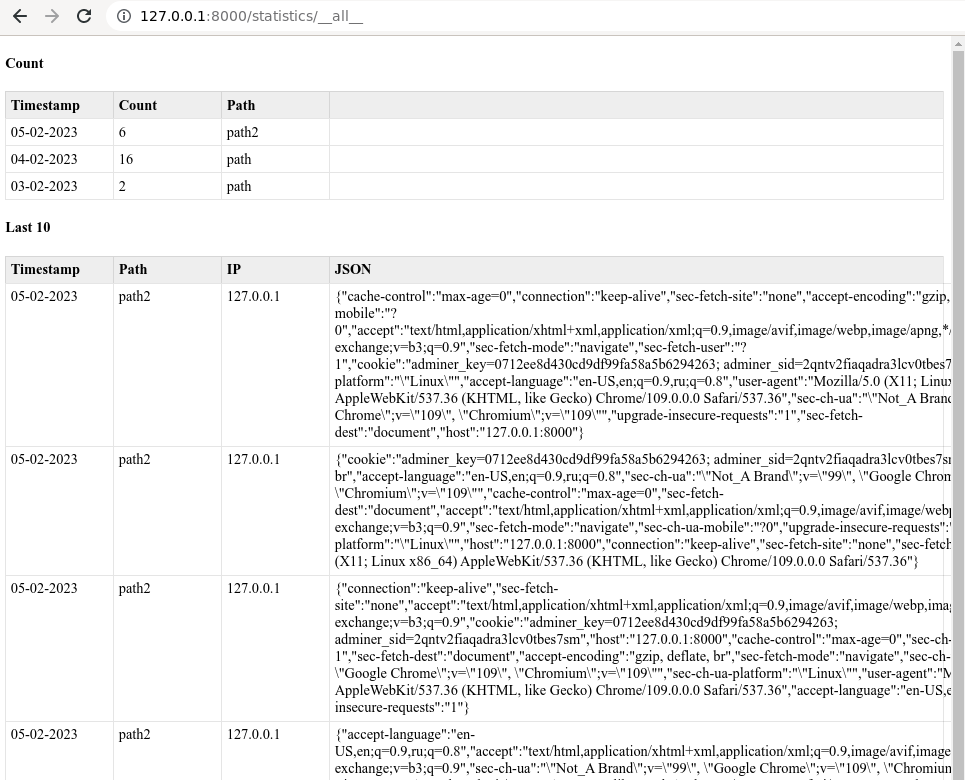

# wapp_simple_stats_rust

CGI счетчик посетителей на rust в базу sqlite3. 
Выводит сохраненную плашку с 

Страницы:
- `counter/<path>` - именной счетчик `<path>`
- `statistics` - страница статистики
- `statistics/__all__` - страница статистики для всех
- `statistics/<path>` - страница статистики для `<path>`
- `statistics_self_full_json` - все данные на json

