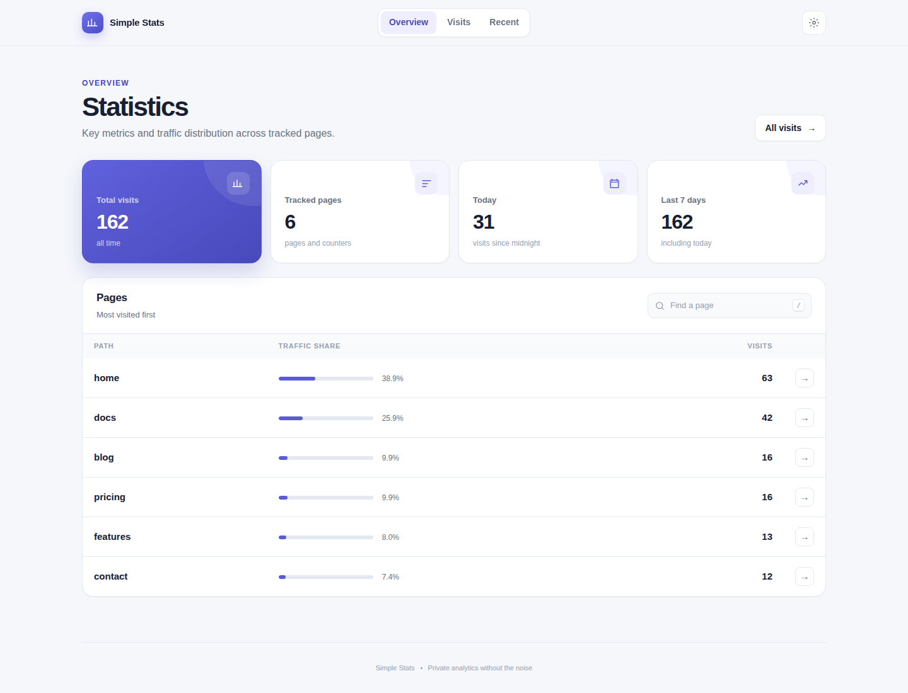

# wapp_simple_stats_rust

Lightweight, self-hosted web counter written in Rust. It stores visits in SQLite and provides a protected, responsive statistics dashboard.

## Features

- Named SVG counters via `GET /counter/<path>`
- Dashboard overview with total, daily and weekly metrics
- A real 30-calendar-day chart, including zero-visit days
- Searchable path table and readable visit cards
- Paginated visit history with extracted browser, referrer and language data
- Automatic light/dark theme without external CDN dependencies
- Basic Auth with constant-time credential comparison
- Exact client IP collection with reverse-proxy support
- Security headers, strict Content Security Policy and protected JSON export
- SQLite WAL mode and indexes for concurrent reads and faster reports

## Screenshots

### Dashboard overview



### All visits


## Project structure

```text
src/
├── main.rs                    # minimal binary entry point
├── lib.rs                     # application bootstrap and Rocket assembly
├── config.rs                  # YAML/environment configuration
├── database.rs                # SQLite initialization and connections
├── models.rs                  # template and export data models
├── utils.rs                   # URL and display helpers
├── routes/
│   ├── counter.rs             # public SVG counter endpoint
│   ├── home.rs                # landing page
│   └── statistics/
│       ├── mod.rs             # statistics HTTP handlers
│       └── queries.rs         # statistics SQL queries
└── security/
    ├── auth.rs                # Basic Auth guard and 401 response
    ├── headers.rs             # security response headers
    └── request_metadata.rs    # safe request metadata collection
```

Unit tests live next to the code they cover. HTTP handlers and SQL access are kept separate so that either layer can evolve without recreating a monolithic entry point.

## Configuration

Copy the example configuration and replace the example password:

```shell
cp config.example.yaml config.yaml
```

For production, keep secrets outside the file:

```shell
export WAPP_STATS_USERNAME="admin"
export WAPP_STATS_PASSWORD="a-long-random-password"
cargo run --release --locked
```

When authentication is enabled, the application refuses to start with an empty username, a password shorter than 12 bytes, or the example password. Disabling authentication is supported for explicitly trusted local networks, but the application prints a warning.

Basic Auth credentials are only transport-safe over HTTPS. Put the application behind an HTTPS reverse proxy before exposing it to the internet. Bind the application to a private or loopback address and configure the proxy to overwrite `X-Real-IP`; never pass a client-controlled value unchanged.

### Privacy

New visits store only these request headers:

- `User-Agent`
- `Accept-Language`
- `Referer` without query parameters or fragments

Cookies, authorization values and arbitrary proxy headers are not stored. Exact client IP addresses are stored without masking. Treat the database as personal data, restrict access, define an appropriate retention period, and disclose this collection in your privacy policy. Existing database rows are not rewritten automatically.

## Endpoints

- `GET /counter/<path>` — records a visit and returns an SVG badge
- `GET /statistics` — dashboard overview (protected)
- `GET /statistics/__all__` — 30-day analytics and complete paginated history (protected)
- `GET /statistics/<path>` — analytics for one counter path (protected)
- `GET /statistics/recent` — latest events across all paths (protected)
- `GET /statistics_self_full_json` — full JSON export (protected)

Embed a counter like this:

```html

```

## Development

The Makefile provides the common development workflow:

```shell
make help
make config
make dev
```

The development server listens on `127.0.0.1:8000` by default. Both values can be overridden without editing configuration files:

```shell
make dev DEV_ADDRESS=0.0.0.0 DEV_PORT=8080
```

Run the complete local check before committing:

```shell
make check
```

Other useful commands include `make watch`, `make release`, `make audit`, `make deps`, `make docs` and `make clean`. `watch` and `audit` print installation instructions when their optional Cargo utilities are missing.

Equivalent Cargo commands:

```shell
cargo fmt -- --check
cargo test --locked
cargo clippy --all-targets --all-features --locked -- -D warnings
```

## License

MIT
