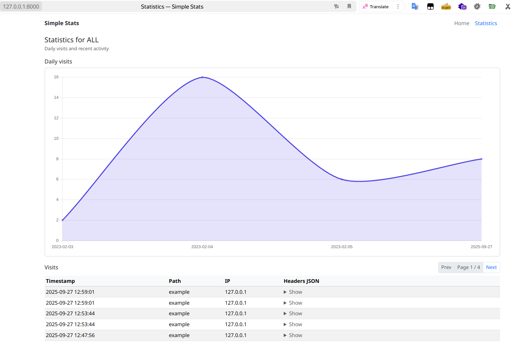

# wapp_simple_stats_rust

Lightweight web counter written in Rust. It stores hits in SQLite and exposes:
- a badge endpoint you can embed anywhere to increment and display a named counter
- a protected statistics dashboard with charts and tables

UI is rendered with Tera templates and styled via Pico.css (CDN). Charts are rendered with Chart.js (CDN). Supports automatic light/dark theme selection.

## Features

- Named counters via `/counter/<path>` (returns an SVG badge)
- Statistics dashboard:
  - Index page: grouped counts by path
  - Path page: daily counts for last 30 entries + last 10 raw visits
- Basic Auth (configurable)
- SQLite storage (file on disk)
- Auto light/dark theme, responsive layout

## Endpoints

- `GET /counter/<path>`
  - Increments counter for `<path>` and returns a small SVG badge
  - Example: ``
- `GET /statistics`
  - Protected by Basic Auth (if enabled)
  - Summary table of all paths
- `GET /statistics/__all__`
  - Protected by Basic Auth (if enabled)
  - Daily counts (last 30 rows) aggregated for all paths + last 10 recent visits
- `GET /statistics/<path>`
  - Protected by Basic Auth (if enabled)
  - Daily counts (last 30 rows) for specific path + last 10 recent visits
- `GET /statistics_self_full_json`
  - Full dataset as JSON (not protected by default)
  - Useful for tooling/integrations

## Usage Examples

Embed a counter badge:
```html

```

## Screenshots



## License

MIT

